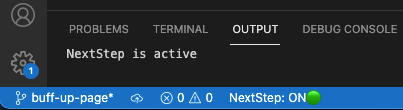
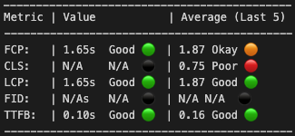

# NextStep

## About
NextStep provides Next.js developers the ability to understand the performance impact of any changes made to their application with real-time visualization of Web Vitals metrics. 

NextStep consists of two parts: 
- NextStep VS Code Extension
- NextStep Metrics NPM Package. 

These two tools work together to automatically calculate web performance scores upon any refresh of a developer's Next.js application, including browser refreshes and hot reloading from within the IDE.  

The NextStep button in the Visual Studio Code Status Bar activates and deactivates the extension. When active, each refresh of the developer's app will generate a table in the Output panel of VS code displaying the latest metrics, along with the moving average of the previous 5 refreshes. Each score is compared against Google's benchmark Core Web Vitals which are defined here, https://web.dev/learn-web-vitals. Any results falling in the "Poor" ranges will direct the user to the Next.js documentation to help identify opportunities for improvement.

The NextStep npm package imports the functionality to automatically capture Web Vitals details within the IDE. 

## Installation
	1. Download and install the NextStep VS Code Extension from the extensions marketplace. 
	2. Run "npm install next-step-metrics" to install the NextStep Metrics npm package.
    npm install next-step-metrics 
	3. In your Next.js application's "/pages/api" folder add a file called "next-step.js" with the following code: 
	
		import nc from "next-connect";
		import { metrics } from "next-step-metrics";
		const handler = nc().post((req, res) => {
		  return metrics(req, res);
		});
		export default handler;
		
	4. In your Next.js application's "/pages/_app.js" file wrap your file with the following lines to import and export out 'reportWebVitals'. It is not necessary to import this function anywhere else in your application.
	
		import { reportWebVitals } from "next-step-metrics";

    export { reportWebVitals };

## Activation and Usage
The NextStep extension adds a button to the Status Bar in Visual Studio Code:

	• "NextStep: ON🟢" indicates that NextStep will capture any changes to the Next.js application's calculated Web Vitals metrics. More information on Google's definitions and benchmarks for Web Vitals can be found here.
	• "NextStep: OFF🔴" indicates that NextStep is not active and will not poll for changes. 
	
Calculated web metrics and their scores are displayed as a table in the Output panel:
TO DO: NEED A BETTER SCREENSHOT

## Additional Information
You MUST install the Next Step Metrics npm package to be able to use this extension. The required set up steps and troubleshooting documentation can be found in the Read Me. 
NextStep is a tool specifically built for Next.js applications. Other frameworks are not currently supported. 